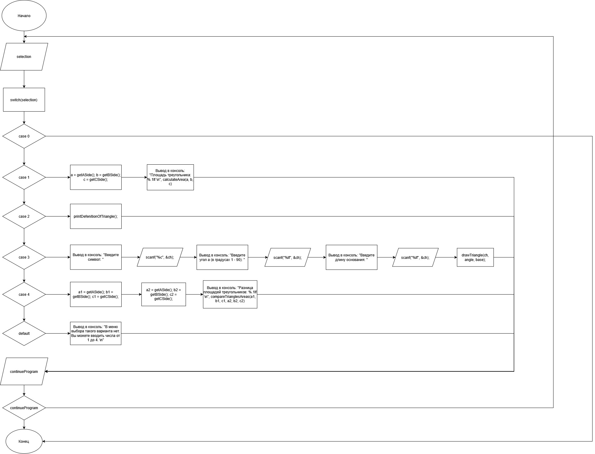

# Домашнее задание к работе 2

## Условие задачи
В течение месяца продавец доставлял на дом 4 л. молока в день. В марте молоко стоило **x** руб. за литр. С первого апреля цена молока увеличилась на **(x + a)** руб. за литр. Сколько надо заплатить продавцу за все доставленное молоко в конце апреля? Количество покупаемого молока осталось прежним.

## 1. Алгоритм и блок-схема

### Алгоритм
1. **Начало**
1. Объявить функции calculateArea, printDefenitionOfTriangle, drawTriangle, compareTrianglesAreas, getASide, getBSide, getCSide.
2. Объявить переменные:
   - `selection` - переменная, отвечающая за сохранение введенного пользователем числа для определежния желания пользователя продолжить работу с программой.
   - `a`, `b`, `c` - переменные для сохранения данных, введенных пользователем для функции calculateArea().
   - `ch`, `angle`, `base` - переменные для сохранения данных, введенных пользователем для функции drawTriangle().
   - `a1`, `b1`, `c1`, `a2`, `b2`, `c2` - переменные для сохранения данных, введенных пользователем для функции compareTrianglesAreas();
   - `aArea`, `bArea` - переменные для сохранения данных, введенных пользователем для функции getSide().
   - `continueProgram` - переменная для определния желания пользователя продолжить работать с программой.
3. Вывести на экран меню выбора команд.
1. Запросить у пользователя ввод определенного числа от 1-4:
   - `scanf("%d", &selection); getchar();`
4. Используем управляющую конструкцию switch для многоальтернативного выбора, которая будет выполнять функцию calculateArea(a, b, c) в случае, если selection = 1, в случае 2 - printDefenitionOfTriangle();, 3 - drawTriangle(ch, angle, base);, 4 - compareTrianglesAreas(a1, b1, c1, a2, b2, c2). 
8. В случае если пользователь введет что-то кроме 1,2,3 и 4 программа напомнит пользователю о том, как выбирать нужную команду, но в случае если пользователь введет 0, программа прекратит выполнение.  
1. По завершении выполнения функции программа попросит ввести число от 0 до 1, где 0 - закончить выполнение программы, а 1 - продолжить с ней работу.
9. **Конец**

### Блок-схема
 


## 2. Реализация программы

```
#include <stdio.h>
#include <math.h>
#include <locale.h>

double calculateArea(double a, double b, double c);
void printDefenitionOfTriangle();
void drawTriangle(char ch, double angle, double base);
double compareTrianglesAreas(double a1, double b1, double c1, double a2, double b2, double c2);
double getASide(); double getBSide(); double getCSide();

int main()
{
    setlocale(LC_ALL, "RUS");
    int selection;
    double a, b, c; // Параметры первого задания
    char ch; double angle; double base; // Параметры третьего задания
    double a1, b1, c1, a2, b2, c2; // Параметры четверотого задания
    double aArea, bArea;

    int continueProgram;
    do
    {
        printf("\n Для выхода из программы введите: 0. \n\nВыберите комадну для работы с треугольником путем ввода соответсвюущего номера: \n1. Рассчитать площадь \n2. Вывести определение фигуры \n3. Нарисовать фигуру символом * (или другим введенным вами символом) \n4. Сравнить площади двух треугольников \n");
        scanf("%d", &selection); getchar();

        switch (selection)
        {
            case 0:
                return 0;
                break;
            case 1:
                a = getASide(); b = getBSide(); c = getCSide();
                printf("Площадь треугольника: %.1lf \n", calculateArea(a, b, c));
                break;
            case 2:
                printDefenitionOfTriangle();
                break;
            case 3:
                printf("Введите символ: ");
                scanf("%c", &ch);

                printf("Введите угол a (в градусах, 1–90): ");
                scanf("%lf", &angle);

                printf("Введите длину основания: ");
                scanf("%lf", &base);

                drawTriangle(ch, angle, base);
                break;
            case 4:
                a1 = getASide(); b1 = getBSide(); c1 = getCSide();
                a2 = getASide(); b2 = getBSide(); c2 = getCSide();
                printf("Разница площадей треугольников: %.1lf \n", compareTrianglesAreas(a1, b1, c1, a2, b2, c2));
                break;
            default:
                printf("В меню выбора такого варианта нет. Вы можете вводить числа от 1 до 4. \n");
                break;
        }

        printf("Продолжить? (1 - да, 0 - нет): ");
        scanf("%d", &continueProgram);
    } while (continueProgram);

    
    system("pause");

    return 0;
}

double calculateArea(double a, double b, double c)
{
    if (a + b > c && b + c > a && c + a > b)
    {
        double p = (a + b + c) / 2;
        double area = sqrt(p * (p - a) * (p - b) * (p - c));
    
        return area;
    }
    else
    {
        return 0;
    }
}

void printDefenitionOfTriangle()
{
    printf("Треугольник — это геометрическая фигура, образованная тремя отрезками, которые соединяют три точки, не лежащие на одной прямой. \nЭти точки называются вершинами, а отрезки — сторонами треугольника. \nТреугольник имеет три угла, и сумма всех его внутренних углов всегда равна 180 градусам. \n");
}

void drawTriangle(char ch, double angle, double base)
{
    printf("\n");

    double rad = angle * 3.14 / 180.0;
    int height = (int)((base / 2.0) * tan(rad) + 0.5);
    
    for (int i = 0; i < height; i++)
    { 
        if (angle > 90 || angle < 0)
        {
            printf("Введенный угол не входит в допустимый интервал.");
            break;
        }

        int width = 1 + (i * (base - 1)) / (height - 1);
        if (height == 1) width = base;

        int spaces = (base - width) / 2;

        for (int s = 0; s < spaces; s++)
            printf(" ");
        for (int w = 0; w < width; w++)
            printf("%c", ch);
        printf("\n");
    }
}

double getASide()
{
    double side;
    printf("Введите сторону a: ");
    scanf("%lf", &side);
    return side;
}

double getBSide()
{
    double side;
    printf("Введите сторону b: ");
    scanf("%lf", &side);
    return side;
}

double getCSide()
{
    double side;
    printf("Введите сторону c: ");
    scanf("%lf", &side);
    return side;
}

double compareTrianglesAreas(double a1, double b1, double c1, double a2, double b2, double c2)
{
    double area1 = calculateArea(a1, b1, c1);
    double area2 = calculateArea(a2, b2, c2);
    double diff = abs(area2 - area1);
    return diff;
}
```

## 3. Результаты работы программы

```

Для выхода из программы введите: 0.


Выберите комадну для работы с треугольником путем ввода соответсвюущего номера:
1. Рассчитать площадь
2. Вывести определение фигуры
3. Нарисовать фигуру символом * (или другим введенным вами символом)
4. Сравнить площади двух треугольников
1
Введите сторону a: 100
Введите сторону b: 100
Введите сторону c: 10
Площадь треугольника: 499,4
Продолжить? (1 - да, 0 - нет): 1

Для выхода из программы введите: 0.


Выберите комадну для работы с треугольником путем ввода соответсвюущего номера:
1. Рассчитать площадь
2. Вывести определение фигуры
3. Нарисовать фигуру символом * (или другим введенным вами символом)
4. Сравнить площади двух треугольников
2
Треугольник - это геометрическая фигура, образованная тремя отрезками, которые соединяют три точки, не лежащие на одной прямой.
Эти точки называются вершинами, а отрезки - сторонами треугольника.
Треугольник имеет три угла, и сумма всех его внутренних углов всегда равна 180 градусам.
Продолжить? (1 - да, 0 - нет): 1

Для выхода из программы введите: 0.


Выберите комадну для работы с треугольником путем ввода соответсвюущего номера:
1. Рассчитать площадь
2. Вывести определение фигуры
3. Нарисовать фигуру символом * (или другим введенным вами символом)
4. Сравнить площади двух треугольников
3
Введите символ: :
Введите угол a (в градусах, 1-90): 45
Введите длину основания: 45

                      :
                     :::
                    :::::
                   :::::::
                  :::::::::
                 :::::::::::
                :::::::::::::
               :::::::::::::::
              :::::::::::::::::
             :::::::::::::::::::
            :::::::::::::::::::::
          ::::::::::::::::::::::::
         ::::::::::::::::::::::::::
        ::::::::::::::::::::::::::::
       ::::::::::::::::::::::::::::::
      ::::::::::::::::::::::::::::::::
     ::::::::::::::::::::::::::::::::::
    ::::::::::::::::::::::::::::::::::::
   ::::::::::::::::::::::::::::::::::::::
  ::::::::::::::::::::::::::::::::::::::::
 ::::::::::::::::::::::::::::::::::::::::::
:::::::::::::::::::::::::::::::::::::::::::::
Продолжить? (1 - да, 0 - нет): 1

Для выхода из программы введите: 0.


Выберите комадну для работы с треугольником путем ввода соответсвюущего номера:
1. Рассчитать площадь
2. Вывести определение фигуры
3. Нарисовать фигуру символом * (или другим введенным вами символом)
4. Сравнить площади двух треугольников
4
Введите сторону a: 100
Введите сторону b: 1000
Введите сторону c: 1000
Введите сторону a: 123
Введите сторону b: 321
Введите сторону c: 123
Разница площадей треугольников: 49937,0
Продолжить? (1 - да, 0 - нет): 0
Для продолжения нажмите любую клавишу . . .

C:\Programs\VS\VSProjects\Homework\HM_10\x64\Debug\HM_10.exe (процесс 5600) завершил работу с кодом 0 (0x0).
Нажмите любую клавишу, чтобы закрыть это окно:
```

## 4. Информация о разработчике

Григорян Эмиль бТИИ-251

